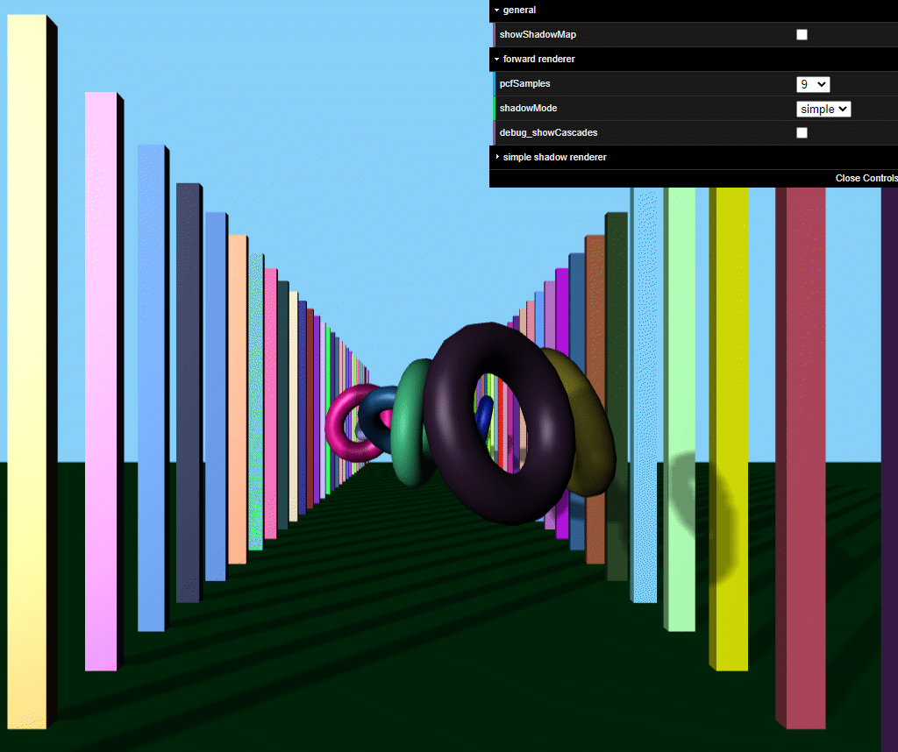

# WebGPU-Cascaded-Shadow-Mapping

Cascaded Shadow Mapping implemented with WebGPU.

This is just an experiment showing a possible CSM implementation in WebGPU.
It is also possible to switch between simple shadow mapping and CSM for comparison.

